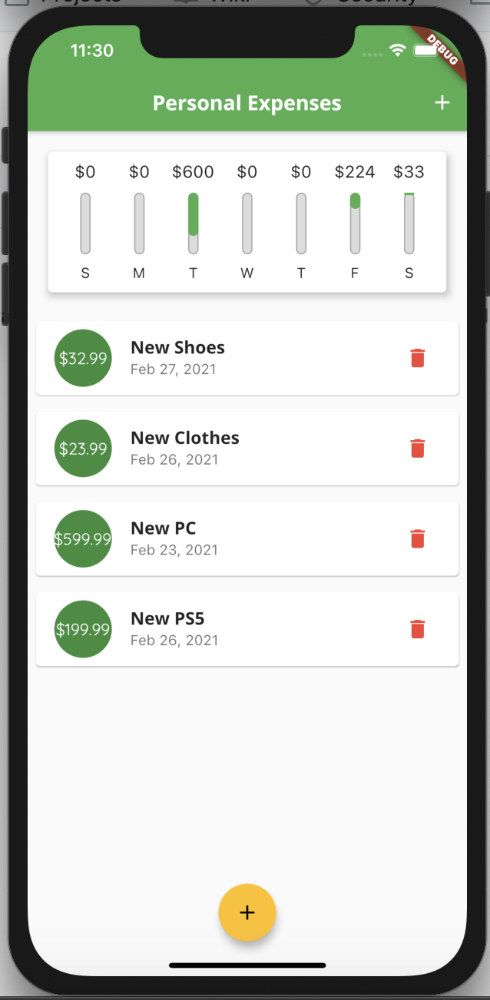
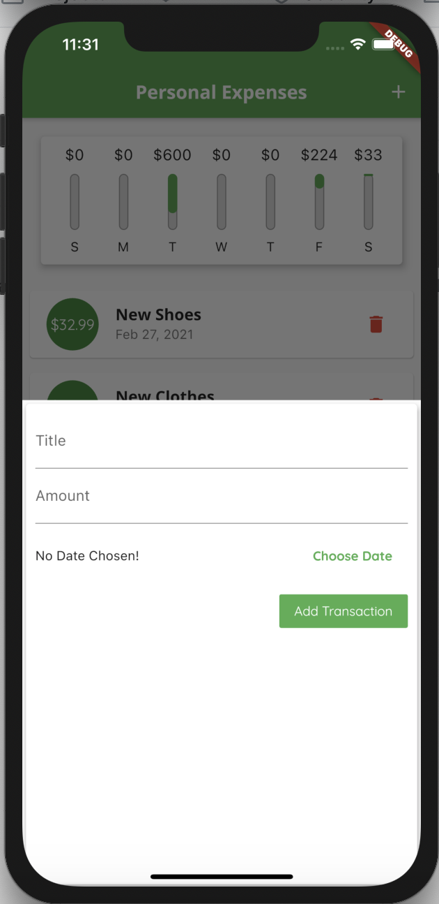
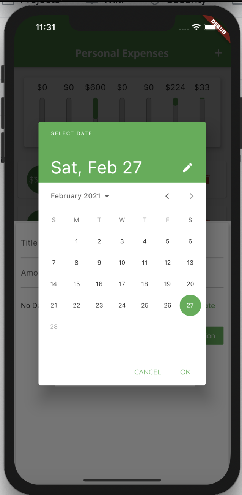

# Personal Expense Tracker

A simple personal expense tracker that allows user to track their total expenses daily for up to 7 days. The application is written using Flutter framework so it can run on both iOS and Android.

# Snapshots

